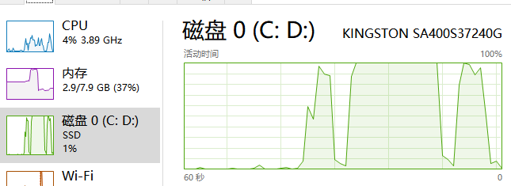

use Commands: 
`gf init .`
modify hack\config.yaml and manifest\config\config.yaml database
`gf gen dao`
modify main.go
`go run main.go` or `gf run main.go`
it's my mem and disk

ctrl+c to terminate or long time loss control

and my gftest.sql